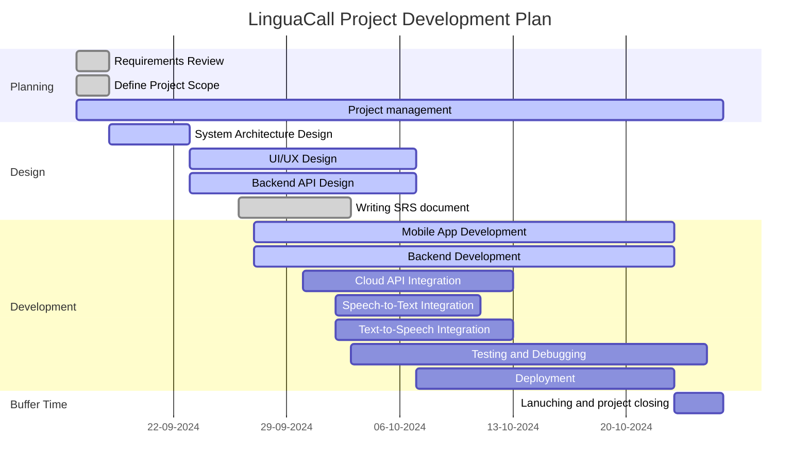

# Project Management Document

#### Phase 1: Planning (16.09.2024 - 20.09.2024)

- **Requirements Presentation**:
    - **Deliverable**: Presentation of Project
    - **Proof**: [Presentation of Project](#)

#### Phase 2: Design (18.09.2024 - 07.10.2024)

- **Project Management**:
    - **Deliverable**: Initial Project Management Plan
    - **Proof**: [Project Plan Link](#)

- **System Architecture Design**:
    - **Deliverable**: System Architecture Document (includes DFD, Use Case, Sequence Diagrams)
    - **Proof**: [Architecture Document Link](#)
- **UI/UX Design**:
    - **Deliverable**: Figma Prototype and Design Document
    - **Proof**: [Figma Design Link](#)
- **Backend API Design**:
    - **Deliverable**: API Design Document
    - **Proof**: [API Design Document Link](#)
- **Writing SRS Document**:
    - **Deliverable**: Finalized Software Requirements Specification (SRS)
    - **Proof**: [SRS Document Link](#)

#### Phase 3: Development (27.09.2024 - 24.10.2024)

- **Mobile App Development**:
    - **Deliverable**: Initial App Build and Source Code
    - **Proof**: [App Source Code Repository](#)
- **Backend Development**:
    - **Deliverable**: Backend Service Code and Documentation
    - **Proof**: [Backend Source Code Repository](#)
- **Cloud API Integration**:
    - **Deliverable**: Integration with YandexCloud Speech-to-Text API
    - **Proof**: [API Integration Documentation](#)
- **Speech-to-Text Integration**:
    - **Deliverable**: Functioning Speech-to-Text Module
    - **Proof**: [Speech-to-Text Integration Code](#)
- **Text-to-Speech Integration**:
    - **Deliverable**: Functioning Text-to-Speech Module
    - **Proof**: [Text-to-Speech Integration Code](#)
- Deployment diagram:
	- Deliverable: Functioning cloud deploy document
	- Proof: Deployment diagram
- **Testing and Debugging**:
    - **Deliverable**: Test Cases and Bug Reports
    - **Proof**: [Test Reports](#)

#### Phase 4: Launching and Project Closing (17.10.2024-24.10.2024)
- **Final Launch and Project Closing**:
    - **Deliverable**: Final Launch Report and Closing Documents
    - **Proof**: [Launch Report and Closing Docs](#)
- Final presentation project Demostration
	- Deliverable: MVP product with testflight link
	- TestFlight Link with presentation and demo video 

| Task                                  | Sergey (Mobile/ ML) | Pan (Mobile, Project manager) | Daniil (Backend/DevOps) | Kirill (Backend/ ML) |
| ------------------------------------- | ------------------- | ----------------------------- | ----------------------- | -------------------- |
| **Requirements Review**               | I                   | R                             | A                       | I                    |
| **Define Project Scope**              | A                   | R                             | I                       | I                    |
| **System Architecture Design**        | I                   | I                             | R                       | A                    |
| **UI/UX Design**                      | R                   | A                             |                         |                      |
| **Backend API Design**                |                     | I                             | R                       | C                    |
| **SRS Document Writing**              |                     | I                             | R                       | R                    |
| **Mobile App Development**        | R               | R, A                     | I                   | I                |
| Deployment                        | I               | R                         | R                   | C                |
| **Backend Development**               |                     |                               | A                       | R                    |
| **Cloud Translation API Integration** | I                   | I, A                          | C                       | R                    |
| **Speech-to-Text Integration**        | R                   | C, A                          | I                       | I                    |
| **Text-to-Speech Integration**        | C                   | R, A                          | I                       | I                    |
| **Testing and Debugging**             | R                   |                               |                         | R                    |
| **Final Launch and Closing**          | C                   | R, A                          | R                       | C                    |
